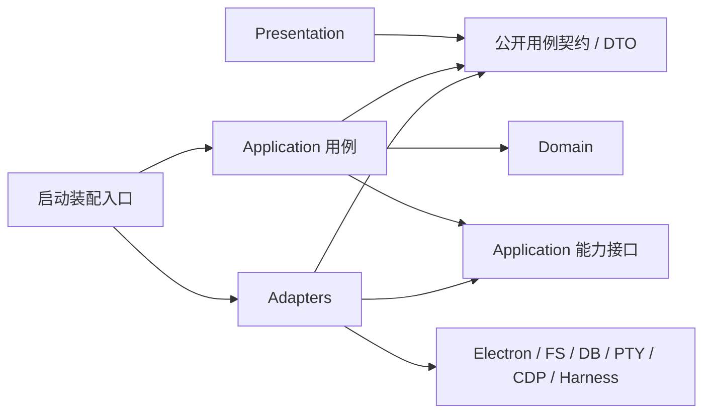
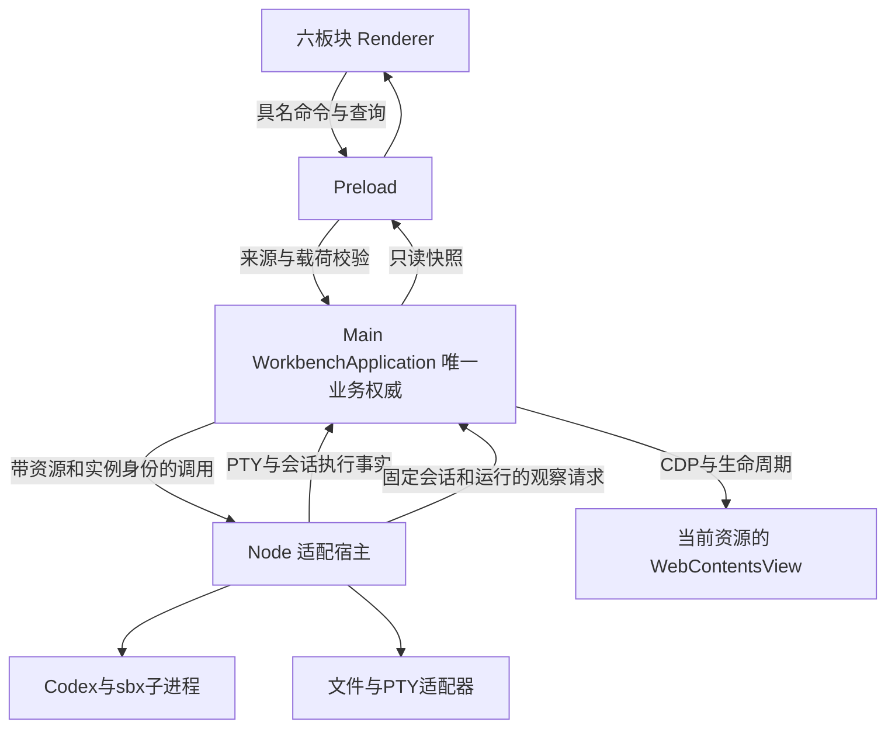

# Web Studio Lab 架构基线

本项目采用按业务职责组织的模块化单体：Electron Main 的 WorkbenchApplication 唯一拥有工作台业务事实，独立 Node 服务承载 Harness、PTY 和文件等适配器，renderer 呈现投影。五个业务模块是责任划分，四个代码层次是依赖约束，进程是运行与权限边界，三者不能互相替代。

本文区分当前实现与后续目标。2026-10-08 的[本地整合合同](acceptance/integration-20261008/SPEC.md)以空间重制提交 `9e1df45` 为基准；实际接线、验证状态与缺口见[当前运行时](architecture/current-runtime.md)和[整合记录](acceptance/integration-20261008/task-summary.md)。2026-10-06 无应用源码的结论仅适用于[当时的基线](architecture/baseline-2026-10-06.md)，不能用于当前树。“必须/建议/可选”的强度见[开发规范](../CONTRIBUTING.md)；模块化单体的历史取舍见[ADR-0001](architecture/adr/0001-modular-monolith.md)。

## 1. 产品职责与范围

全局首页、空间、资源、会话、任务和设置直接可达。空间页内的资源窗格展示网页、文件和终端，会话标签承载对话、现场、目标与运行记录；任务页展示同一 Main 快照中的历史。Workspace 组织资源、会话、上下文和布局。导航入口不是业务模块；同一个任务可以在多个视图中展示，但只有一个业务状态所有者。

首版围绕一个固定 TypeScript 全栈模板，完成“提出需求 → 修改代码 → 运行 → 验证 → 审阅”，一个项目、一个 Agent 串行执行。优先接现成 Codex CLI Harness；有效版本、参数、模型和工具组合须在接入时实测。本次整合不补做尚未实现的母模板、业务 API、独立检查器或产品验收 adapter，不增加云账号、好友、订阅、多 Agent 调度、实时协作、第二模板或生成 App 部署。现有资源在切换视图后继续运行，不等于实现后台任务调度器。

长期分工：Rein 提供单 Agent Harness/runtime；Veriflow 负责任务编排、验收、修复策略与证据组织；Web Studio 提供工作环境、浏览器、终端、文件和交互。当前 Lab 用最小本地应用用例承接所需编排，不要求依赖三个仓库。后续接 Rein/Veriflow 时通过能力接口替换相应实现，必须保持一个任务权威写入者，不在 Main、服务和外部编排器各做一份流程。

## 2. 业务模块及状态所有权

以下是职责分解；当前空间、资源描述、会话与任务事实集中由 Main WorkbenchApplication 写入，适配器只报告执行事实。表中写入许可、独立验证、条件文件保存等仍属未来目标，不是要求创建五个包或五套空目录。保留参考的五组职责，因为它们分别因项目身份、资源生命周期、上下文、执行推进、结果判定而变化；跨组数据可以共同存储，写入权限仍归所属模块。

| 模块             | 职责与权威状态                                                                                                 | 公开能力（语义，非已有函数）                                   | 依赖能力与协作                                                                                 |
| ---------------- | -------------------------------------------------------------------------------------------------------------- | -------------------------------------------------------------- | ---------------------------------------------------------------------------------------------- |
| 空间与项目       | Workspace/Project 注册、项目根目录与获准访问范围、资源归属关系；不拥有运行进程或任务状态                       | 注册/读取项目、解析明确项目身份与权限范围、移除关联            | 为其余模块提供只读项目描述和范围判定；接文件选择/配置持久化适配器                              |
| 资源与运行环境   | Resource 描述、ResourceInstance 生命周期、AppInstance 进程组/端口/数据目录、文件版本与保存结果；不判定任务成功 | 打开/释放实例、读取/条件保存文件、启动/停止应用、页面操作/采集 | 用项目范围和任务写入许可；通过文件、PTY、CDP、进程适配器执行；向任务/验证报告事实              |
| 会话与上下文     | Session、消息、用户选择的上下文引用、不可变上下文快照及失效标记；不拥有执行输入的后续变更权                    | 管理会话、采集/冻结上下文、按页面代次使引用失效                | 读取项目身份和资源采集结果；将快照交任务用例，展示任务引用但不修改任务内部                     |
| 任务与执行       | Task/TaskVersion、TaskRun、attempt、预算、项目写入许可、执行事件序列和取消/恢复状态                            | 确认目标、创建/查询/取消执行、按固定策略推进或修复             | 读取项目/上下文；调用资源、Harness 端口及验证公开接口；只引用验证/审阅结果，不替它们写表       |
| 验证、结果与审阅 | 验证要求版本、VerificationResult、证据索引、ReviewDecision 及适用性判定；不修改业务代码                        | 对指定快照验证、查询差异/证据、接受或要求修改                  | 读取 TaskVersion、执行输出和资源实例；调用验证适配器；将失败证据交任务模块决定是否在预算内修复 |

任务用例协调以上能力；其他模块不反向依赖任务编排的内部实现。资源需要的写入许可由装配层注入或作为已验证能力传入，验证所需任务输入使用公开只读快照，避免相互导入整个模块形成环。

### 术语与身份

| 概念 / ID                                    | 含义与所有者                                                                                 | 必须区分                                                                                   |
| -------------------------------------------- | -------------------------------------------------------------------------------------------- | ------------------------------------------------------------------------------------------ |
| Workspace / `workspaceId`                    | 空间与项目模块拥有的组织和授权范围                                                           | 不是一个临时 cwd；主 checkout 历史计划曾把工作目录称 workspace，整合时须分清               |
| Project / `projectId`                        | 一个明确根目录、代码和数据归属的项目；空间与项目拥有                                         | 当前焦点项目不是已创建执行的项目                                                           |
| Resource / `resourceId`                      | 可重新打开的网页/文件/终端等描述；资源模块拥有                                               | 描述不是进程，也不是标签页                                                                 |
| ResourceInstance / `resourceInstanceId`      | 已打开页面、文件缓冲或终端的活动实例；资源模块拥有                                           | 同一资源可有多个实例；实例可没有可见 View                                                  |
| View / `viewId`                              | 标签页/窗格中的展示绑定、布局与焦点；Main保存可恢复分割树，Presentation处理临时显隐与DOM测量 | 关闭 View 不删除 Resource，不等于停止实例                                                  |
| Session / `sessionId`                        | 一段对话及上下文选择；会话模块拥有                                                           | Electron Chromium session 是隔离适配细节，用 `browserSessionKey` 区分                      |
| Task / `taskId`；TaskVersion / `taskVersion` | 用户目标和确认版本；任务模块拥有，版本字段组合为 `taskId` + `version`                        | 消息不直接成为执行；目标变化产生新版本                                                     |
| TaskRun / `runId`                            | 一次基于固定任务版本的执行或无模型复验；任务模块拥有                                         | 沿用已有分支 `RunRecord.runId`，全文仅指任务执行；新代码变量应带明确上下文，不用于应用启动 |
| Attempt / `attemptId`                        | 同一 TaskRun 内一次修改与验证尝试；任务模块拥有                                              | 修复不刷新总预算；输入目标改变需新 TaskVersion/TaskRun                                     |
| AppInstance / `appInstanceId`                | 一次前端/API 启动组合及所属进程、数据目录；资源模块拥有                                      | 一个 TaskRun 可顺序启动多个 AppInstance；一个应用可支持多个页面实例                        |
| 执行结果                                     | TaskRun 的退出原因、输出代码引用、文件变更与清理事实；任务模块拥有                           | 不是验证通过或用户接受                                                                     |
| VerificationResult / `verificationId`        | 一次绑定输入版本与条件的验证事实；验证模块拥有                                               | 无法运行是 `undetermined`，业务断言不满足是 `failed`                                       |
| ReviewDecision / `reviewId`                  | 用户对具体目标、代码和结果的接受/要求修改记录；审阅模块拥有                                  | Harness 退出 0、验证通过都不等于接受                                                       |
| SourceSnapshot / `sourceSnapshotId`          | 资源模块生成的不可变代码内容标识，由执行/验证引用                                            | HEAD 不覆盖 dirty/untracked 内容；不能只存 `baseCommit`                                    |

上述是语义基线；未实现的 ID 不意味着本树已有 schema。沿用已有 `runId` 避免无必要接口重命名，应用启动必须使用 `appInstanceId`，只读历史查看不新建 run、不采用 `replay` 执行模式。`TaskRun` 是业务术语，整合已有 `RunRecord` 类型时无需为改名引入第二套对象。

## 3. 代码分层与源码依赖

| 层                           | 放什么                                                       | 不放什么                                               |
| ---------------------------- | ------------------------------------------------------------ | ------------------------------------------------------ |
| Presentation                 | React UI、布局/焦点、未提交输入、业务只读投影；UI 用例客户端 | 项目写入、执行状态机、验收判断、直接访问 Node/Electron |
| Application                  | 用例、协调、事务/副作用边界、流程和能力接口                  | 具体数据库、进程 API、Harness SDK/命令细节             |
| Domain                       | 必要的业务对象、不变量与状态转换                             | React、Electron、文件/数据库驱动、具体 Harness         |
| Adapters                     | Electron IPC、文件/持久化、PTY、CDP、Harness/验证/子进程接入 | 再实现一套任务状态机或修改验收目标                     |
| Composition root（装配入口） | 选择具体适配器、连接端口、启动和关闭作用域                   | 业务判断和各模块权威状态                               |

下图箭头 **A → B 表示 A 的源码可以依赖/import B**，不表示线程或运行时请求。

跨进程时 UI 依赖用例客户端契约，经 IPC 适配器调用 Application；同进程可直接调用公开用例。运行时 Application 会调用注入的适配器对象，但源码只依赖它需要的接口。Domain 不反向引用 Application 或 Adapters。接口由需要能力的模块定义；不得为满足图形创建没有真实消费者的接口。

模块以公开入口协作（独立包用包出口，模块可用 `index.ts` 或明确用例文件）。严禁深层导入私有 store、修改对方状态或数据库表。`packages/protocol` 只容纳确实跨进程共享的 schema、DTO、事件信封；不是全局业务模型包。内部领域对象无需为共享而外露。普通查询和记录直接实现，不机械套复杂聚合、事件溯源或通用 Repository。

### 现有物理落点与后续接入

`apps/desktop`、`apps/service`、`packages/protocol` 已存在；下表区分当前宿主与后续职责。`templates/task-app` 和比赛 C1–C3 验收仍未实现；`fixtures/vertical-slice` 与 `tests/vertical-slice` 是独立的 VS001 固定基线。

| 位置                                           | 责任                                                                                                                 |
| ---------------------------------------------- | -------------------------------------------------------------------------------------------------------------------- |
| `apps/desktop/src/renderer`                    | Presentation 与用例客户端；`workbench` 消费 Main 快照，不恢复旧 `state/runs.ts` 业务状态                             |
| `apps/desktop/src/preload`                     | 窄桥接，使用协议，不导入任务用例实现                                                                                 |
| `apps/desktop/src/main`                        | `workbench/application.ts` 业务权威、`ports.ts` 能力端口、`host.ts` 装配与原生浏览器适配；窗口、可信来源检查和持久化 |
| `apps/service`                                 | Electron 无关的 Node 适配宿主：Codex/sbx、PTY、文件、SSH/SFTP、资源 MCP；不另建空间或任务权威                        |
| `packages/protocol`                            | 唯一跨进程契约源，延续已有 Zod/类型导出                                                                              |
| `templates/task-app`、`acceptance`、`fixtures` | 后续固定模板、独立验收和初态；模板可独立交付，验收走公开 UI/API，不导入被测内部实现                                  |

`apps/service` 中的 service 表示执行宿主，不要求 HTTP 服务。现有包结构已满足需求就保留；当前具体实现与已验证范围见 [当前运行时](architecture/current-runtime.md)，不为满足分层图创建第二套实现。

## 4. 进程、通信与权限

当前运行关系如下；箭头为消息方向。AppInstance、独立验证器和固定模板闭环尚未接入，不能从该图推导它们可用。

独立 Node 适配宿主由 Electron utility process 承载，服务源码无 Electron import。Main 通过注入端口协调业务和原生页面；服务维护所属子进程、传输状态与有界缓冲，不复制 Main 的空间、任务版本、运行和审阅状态。将来 CLI 复验须复用同一业务权威；当前没有独立 CLI 产品验收入口。打包与真实连接是否通过以本轮执行记录为准。

不恢复旧草案的工作台 Hono/WS 监听服务、随机端口/token 发现接口；生成 App 自己的 API 可继续用 Hono。项目页面与工作台 IPC 没有直接通道。运行页面、文件内容和工具输出是外部输入，只能补充上下文，不能自行增加工具、路径、命令或预算权限。

目标 Electron 基线：工作台和预览均使用 `contextIsolation: true`、`sandbox: true`、`nodeIntegration: false`、`webSecurity: true`；项目预览无工作台 preload，隔离 browser session，权限默认拒绝，导航/新窗口/外部 URL 按显式策略处理。Main 校验实际 sender、顶层 frame 与来源，并校验请求载荷；Preload 只暴露具名能力及取消订阅，不暴露原始 `ipcRenderer`、任意通道或通用执行脚本能力。这些原则依据 [Electron 官方安全指南](https://www.electronjs.org/docs/latest/tutorial/security)，本次保全运行了离线检查与构建；真实窗口与完整隔离行为不能由这些检查替代，历史结果见具体合同。

文件适配器必须以固定项目根和获准范围解析路径，检查规范化、符号链接及新建文件父路径；不可用字符串前缀或只信任 Renderer 传入路径。模型凭据由受控适配器按需取得，不进入普通日志、协议 DTO 或默认模型上下文。子进程只接收必要环境、cwd 和能力；Electron renderer sandbox 不等于 Harness/项目 Node 进程的 OS 沙箱。若接入能力不能保证所需范围，应阻止该能力或明确要求新的授权，不能将 UI 白名单包装为强隔离。

## 5. 生命周期与一致性约束

本节区分已有运行事实与完整闭环约束。Main 已持有任务版本、执行、取消与历史；项目统一写入许可、AppInstance 和独立检查器仍未实现。检查方式同时作为接入时的验收输入。

| 操作/不变量          | 责任与语义                                                                                                                         | 接入验收                                                                                   |
| -------------------- | ---------------------------------------------------------------------------------------------------------------------------------- | ------------------------------------------------------------------------------------------ |
| 关闭分页或窗格       | Presentation 解除 View/布局绑定；保留 Resource 和可恢复实例。不隐式取消 TaskRun 或停止应用                                         | 隐藏/恢复后身份一致，运行状态不被 UI 写回                                                  |
| 停止应用             | 资源模块停止指定 `appInstanceId` 的进程组，确认退出；不删除文件、不撤销修改。关联执行收到停止事实                                  | 真实进程与端口释放；不能按进程名/端口批量杀进程                                            |
| 取消任务             | 任务模块先关闭新动作入口，进入 `cancelling`；调用 Harness 取消及所属资源停止，等待确认后才能标为已取消                             | 在执行中取消，观察新动作停止、执行器及子进程退出、已有 diff 保留；未确认则保持可见未决状态 |
| 移除资源             | 资源模块移除描述/关联；活跃消费者存在时拒绝并给出显式停止/解除步骤，不悄悄破坏任务                                                 | 移除不等于删除磁盘文件；文件删除是独立授权操作                                             |
| 执行输入不随焦点变化 | 创建时固定 `workspaceId`、`projectId`、`taskId/version`、上下文快照、基线 `sourceSnapshotId`、权限及预算                           | 切项目/页面后仍对原项目执行；任务变化生成新版本与新 run                                    |
| 同项目统一写入控制   | 任务与执行模块拥有项目写入许可；Agent 修改、编辑器保存、迁移/修复等 Lab 发起的写入走同一控制。首版拒绝第二个写入执行，不做后台队列 | 重复启动和并行保存有明确冲突；未确认停止不得释放许可让第二个执行覆盖                       |
| 文件版本冲突         | 资源模块保存使用读取时版本/内容哈希，写前及写后核对；外部工具或用户修改产生冲突，保留双方内容，不自动覆盖                          | 插入外部修改、删除和新建碰撞后，报冲突并保留文件                                           |
| 结果分离             | 任务目标版本、TaskRun 结束、验证结果、用户接受各有记录和所有者                                                                     | Harness 退出 0 不能生成验证通过；验证通过不能自动接受                                      |
| 验证绑定             | 固定输出快照、TaskVersion、验收版本/hash、环境/依赖/命令/数据版本及 AppInstance                                                    | 代码或条件变化后，旧结果留作历史，当前状态变为待验证/不适用                                |
| 异常恢复             | 执行核心核对文件快照、进程身份和未确认结果，必要时进入 `interrupted`/待核对；不直接重放命令                                        | 模拟响应丢失或宿主崩溃，不重复迁移/写入，不误杀复用 PID 的无关进程                         |

统一写入许可控制的是 Lab 自己发起的动作，不能锁住所有外部编辑器。不能用“检查哈希后直接覆盖”宣称任意外部并发原子安全；Harness 接入时须明确使用受控写入工具或隔离修改副本并带版本条件应用，外部冲突必须可见。由哪个具体适配器落实写入与冲突检查，须与 Harness 能力一起验证；目前未实现。

### 目标状态与结果适用性

TaskVersion 确认后不可变。当前运行状态以 `packages/protocol/src/workspace.ts` 的 schema 和 Main 转换为准，区分运行、取消、失败和重启中断；演示 RunRecord 仅用于标注的样本。`completed` 表示执行结束，不能推导独立验收或用户接受。后续增加 preparing/attempt 等流程时扩展同一契约，不另建 UI 状态机。

验证状态独立为 `passed / failed / undetermined`；未运行单独显示。用户审阅独立为待审阅、接受或要求修改。沿用既有交互契约：只有固定验收通过且仍适用于当前版本，才能进入接受操作；未通过时可以记录意见或要求修改，不能标为接受。接受记录绑定任务版本、代码快照和相关结果，不改写验证状态。新代码、新目标或新的复验不继承旧接受；旧记录不可覆写。

SourceSnapshot 必须覆盖实际参与验证/交付的完整代码内容，包括未跟踪新文件、迁移和锁文件；明确排除凭据和非输入构建产物。记录基线 commit、变更与完整内容标识，不只记录 HEAD 或 diffHash。验证使用固定快照/隔离副本；必须使用可变目录时至少检验前后内容一致，变化即无法判定该轮有效性。无模型复验创建新 TaskRun 并引用 `sourceRunId`，使用原验收要求和明确的新运行条件；历史查看只读取旧记录。

取消/超时先阻止新工具动作，再传播停止到 Harness、验证器和本次独占的 AppInstance/子进程，记录实际退出；共享或用户先前打开的资源只有取得所有权后才能停止。停止等待超时要报告尚存进程和未决结果，不把 `Promise` 已取消当作进程已停止。Lab 退出也走同一清理入口；首版不把任务悄悄留在后台。

## 6. 约束怎样落地

当前落点是 Main 工作台、窄 IPC、原生预览、独立服务、恢复与测试；完整比赛业务闭环仍有明确缺口。具体源码路径、配置和验证入口集中在[当前运行时](architecture/current-runtime.md)、[README](../README.md)与[开发依赖](development/dependencies.md)。

跨分支整合保留历史证据，以[INTEGRATION-1](acceptance/integration-20261008/SPEC.md)的来源台账和逐阶段检查为依据。原始 architecture/VS001 记录保留当时结论；不把旧文档中的 service 权威建议当作恢复第二套状态的指令。每项新能力先明确 Main 身份与权限来源，接 Provider、生命周期和持久化，再接 renderer 与 MCP 消费者，最后在同一最终源码复验。
