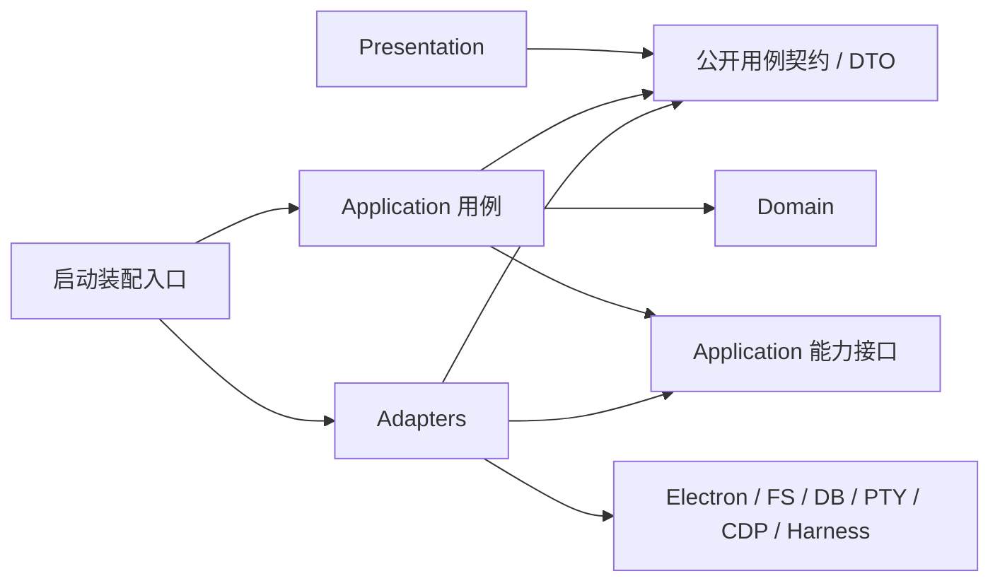
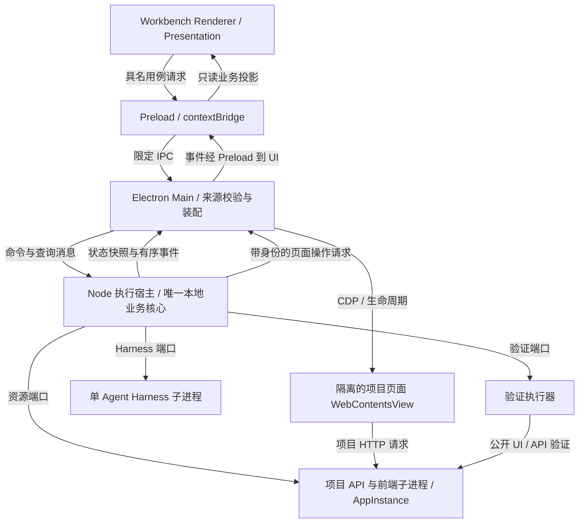

# Web Studio Lab 架构基线

本项目采用按业务职责组织的模块化单体：一个本地执行核心拥有任务流程，Electron 提供工作环境与用户交互，外部 Harness 通过接口接入。五个业务模块是责任划分，四个代码层次是依赖约束，进程是运行与权限边界，三者不能互相替代。

本文是整合后的目标架构与后续实现约束，不是已有功能清单。2026-10-07 已纳入产品 checkpoint 与 main 的 VS001 验收基线；实际落点、安全边界与缺口见 [当前运行时](architecture/current-runtime.md)。2026-10-06 审查时，本树 `536f0a1` 无应用源码；其他 checkout 的局部实现、设计输入、差异和本轮检查见 [基线记录](architecture/baseline-2026-10-06.md)。“必须/建议/可选”的强度及验证要求见 [开发规范](../CONTRIBUTING.md)。重要取舍见 [ADR-0001](architecture/adr/0001-modular-monolith.md)。

## 1. 产品职责与范围

Browser 展示和操作网页、文件、终端等工作资源。Workshop 承载当前会话、目标确认、任务进展、修改和结果审阅。Workspace 组织项目、资源、上下文、权限和布局。导航入口不是业务模块；同一个任务可以在多个视图中展示，但只有一个业务状态所有者。

首版围绕一个固定 TypeScript 全栈模板，完成“提出需求 → 修改代码 → 运行 → 验证 → 审阅”，一个项目、一个 Agent 串行执行。优先接现成 Codex CLI Harness；有效版本、参数、模型和工具组合须在接入时实测。本次版本整合不新增此链路，不增加云账号、好友、订阅、多 Agent 调度、实时协作、后台任务、第二模板或生成 App 部署。

长期分工：Rein 提供单 Agent Harness/runtime；Veriflow 负责任务编排、验收、修复策略与证据组织；Web Studio 提供工作环境、浏览器、终端、文件和交互。当前 Lab 用最小本地应用用例承接所需编排，不要求依赖三个仓库。后续接 Rein/Veriflow 时通过能力接口替换相应实现，必须保持一个任务权威写入者，不在 Main、服务和外部编排器各做一份流程。

## 2. 业务模块及状态所有权

以下是责任归属目标；现有聊天、资源和预览只实现其中局部能力，不是要求创建五个包或五套空目录。保留参考的五组职责，因为它们分别因项目身份、资源生命周期、上下文、执行推进、结果判定而变化；跨组数据可以共同存储，写入权限仍归所属模块。

| 模块 | 职责与权威状态 | 公开能力（语义，非已有函数） | 依赖能力与协作 |
| --- | --- | --- | --- |
| 空间与项目 | Workspace/Project 注册、项目根目录与获准访问范围、资源归属关系；不拥有运行进程或任务状态 | 注册/读取项目、解析明确项目身份与权限范围、移除关联 | 为其余模块提供只读项目描述和范围判定；接文件选择/配置持久化适配器 |
| 资源与运行环境 | Resource 描述、ResourceInstance 生命周期、AppInstance 进程组/端口/数据目录、文件版本与保存结果；不判定任务成功 | 打开/释放实例、读取/条件保存文件、启动/停止应用、页面操作/采集 | 用项目范围和任务写入许可；通过文件、PTY、CDP、进程适配器执行；向任务/验证报告事实 |
| 会话与上下文 | Session、消息、用户选择的上下文引用、不可变上下文快照及失效标记；不拥有执行输入的后续变更权 | 管理会话、采集/冻结上下文、按页面代次使引用失效 | 读取项目身份和资源采集结果；将快照交任务用例，展示任务引用但不修改任务内部 |
| 任务与执行 | Task/TaskVersion、TaskRun、attempt、预算、项目写入许可、执行事件序列和取消/恢复状态 | 确认目标、创建/查询/取消执行、按固定策略推进或修复 | 读取项目/上下文；调用资源、Harness 端口及验证公开接口；只引用验证/审阅结果，不替它们写表 |
| 验证、结果与审阅 | 验证要求版本、VerificationResult、证据索引、ReviewDecision 及适用性判定；不修改业务代码 | 对指定快照验证、查询差异/证据、接受或要求修改 | 读取 TaskVersion、执行输出和资源实例；调用验证适配器；将失败证据交任务模块决定是否在预算内修复 |

任务用例协调以上能力；其他模块不反向依赖任务编排的内部实现。资源需要的写入许可由装配层注入或作为已验证能力传入，验证所需任务输入使用公开只读快照，避免相互导入整个模块形成环。

### 术语与身份

| 概念 / ID | 含义与所有者 | 必须区分 |
| --- | --- | --- |
| Workspace / `workspaceId` | 空间与项目模块拥有的组织和授权范围 | 不是一个临时 cwd；主 checkout 历史计划曾把工作目录称 workspace，整合时须分清 |
| Project / `projectId` | 一个明确根目录、代码和数据归属的项目；空间与项目拥有 | 当前焦点项目不是已创建执行的项目 |
| Resource / `resourceId` | 可重新打开的网页/文件/终端等描述；资源模块拥有 | 描述不是进程，也不是标签页 |
| ResourceInstance / `resourceInstanceId` | 已打开页面、文件缓冲或终端的活动实例；资源模块拥有 | 同一资源可有多个实例；实例可没有可见 View |
| View / `viewId` | 标签页/窗格中的展示绑定、布局与焦点；Presentation 拥有 | 关闭 View 不删除 Resource，不等于停止实例 |
| Session / `sessionId` | 一段对话及上下文选择；会话模块拥有 | Electron Chromium session 是隔离适配细节，用 `browserSessionKey` 区分 |
| Task / `taskId`；TaskVersion / `taskVersion` | 用户目标和确认版本；任务模块拥有，版本字段组合为 `taskId` + `version` | 消息不直接成为执行；目标变化产生新版本 |
| TaskRun / `runId` | 一次基于固定任务版本的执行或无模型复验；任务模块拥有 | 沿用已有分支 `RunRecord.runId`，全文仅指任务执行；新代码变量应带明确上下文，不用于应用启动 |
| Attempt / `attemptId` | 同一 TaskRun 内一次修改与验证尝试；任务模块拥有 | 修复不刷新总预算；输入目标改变需新 TaskVersion/TaskRun |
| AppInstance / `appInstanceId` | 一次前端/API 启动组合及所属进程、数据目录；资源模块拥有 | 一个 TaskRun 可顺序启动多个 AppInstance；一个应用可支持多个页面实例 |
| 执行结果 | TaskRun 的退出原因、输出代码引用、文件变更与清理事实；任务模块拥有 | 不是验证通过或用户接受 |
| VerificationResult / `verificationId` | 一次绑定输入版本与条件的验证事实；验证模块拥有 | 无法运行是 `undetermined`，业务断言不满足是 `failed` |
| ReviewDecision / `reviewId` | 用户对具体目标、代码和结果的接受/要求修改记录；审阅模块拥有 | Harness 退出 0、验证通过都不等于接受 |
| SourceSnapshot / `sourceSnapshotId` | 资源模块生成的不可变代码内容标识，由执行/验证引用 | HEAD 不覆盖 dirty/untracked 内容；不能只存 `baseCommit` |

上述是语义基线；未实现的 ID 不意味着本树已有 schema。沿用已有 `runId` 避免无必要接口重命名，应用启动必须使用 `appInstanceId`，只读历史查看不新建 run、不采用 `replay` 执行模式。`TaskRun` 是业务术语，整合已有 `RunRecord` 类型时无需为改名引入第二套对象。

## 3. 代码分层与源码依赖

| 层 | 放什么 | 不放什么 |
| --- | --- | --- |
| Presentation | React UI、布局/焦点、未提交输入、业务只读投影；UI 用例客户端 | 项目写入、执行状态机、验收判断、直接访问 Node/Electron |
| Application | 用例、协调、事务/副作用边界、流程和能力接口 | 具体数据库、进程 API、Harness SDK/命令细节 |
| Domain | 必要的业务对象、不变量与状态转换 | React、Electron、文件/数据库驱动、具体 Harness |
| Adapters | Electron IPC、文件/持久化、PTY、CDP、Harness/验证/子进程接入 | 再实现一套任务状态机或修改验收目标 |
| Composition root（装配入口） | 选择具体适配器、连接端口、启动和关闭作用域 | 业务判断和各模块权威状态 |

下图箭头 **A → B 表示 A 的源码可以依赖/import B**，不表示线程或运行时请求。

跨进程时 UI 依赖用例客户端契约，经 IPC 适配器调用 Application；同进程可直接调用公开用例。运行时 Application 会调用注入的适配器对象，但源码只依赖它需要的接口。Domain 不反向引用 Application 或 Adapters。接口由需要能力的模块定义；不得为满足图形创建没有真实消费者的接口。

模块以公开入口协作（独立包用包出口，模块可用 `index.ts` 或明确用例文件）。严禁深层导入私有 store、修改对方状态或数据库表。`packages/protocol` 只容纳确实跨进程共享的 schema、DTO、事件信封；不是全局业务模型包。内部领域对象无需为共享而外露。普通查询和记录直接实现，不机械套复杂聚合、事件溯源或通用 Repository。

### 现有物理落点与后续接入

`apps/desktop`、`apps/service`、`packages/protocol` 已存在；下表区分当前宿主与后续职责。`templates/task-app` 和比赛 C1–C3 验收仍未实现；`fixtures/vertical-slice` 与 `tests/vertical-slice` 是独立的 VS001 固定基线。

| 位置 | 责任 |
| --- | --- |
| `apps/desktop/src/renderer` | Presentation 与用例客户端；既有 `state/runs.ts` 的演示投影不升级为任务数据库 |
| `apps/desktop/src/preload` | 窄桥接，使用协议，不导入任务用例实现 |
| `apps/desktop/src/main` | 窗口、可信来源检查、浏览器/OS 适配和进程装配；现有 `execution.ts` 留作薄转发入口 |
| `apps/service` | Electron 无关的本地业务核心与 Node 宿主；按需要放五模块应用/领域/适配代码，不复制五套空目录 |
| `packages/protocol` | 唯一跨进程契约源，延续已有 Zod/类型导出 |
| `templates/task-app`、`acceptance`、`fixtures` | 后续固定模板、独立验收和初态；模板可独立交付，验收走公开 UI/API，不导入被测内部实现 |

`apps/service` 中的 service 表示执行宿主，不要求 HTTP 服务。现有包结构已满足需求就保留；当前具体实现与已验证范围见 [当前运行时](architecture/current-runtime.md)，不为满足分层图创建第二套实现。

## 4. 进程、通信与权限

目标运行关系如下；箭头是 **带标签的运行时调用/消息方向**，不是源码依赖。图中的聊天/终端消息宿主已有实现；完整任务编排、AppInstance 与固定验收连接尚未实现。

首版选择独立 Node 执行宿主，可由 Electron utility process 承载；核心应用/领域代码无 Electron import。Main 仅启动宿主、转发经过校验的命令、管理 Electron 资源；页面能力以消息适配器供核心调用。CLI 复验将来调用同一核心。Main 和执行宿主不得各维护 TaskRun、重试、验收或取消状态机。现有聊天宿主与版本前提见当前运行时；任务执行宿主和完整打包通路仍须在接入时实测。

不恢复旧草案的工作台 Hono/WS 监听服务、随机端口/token 发现接口；生成 App 自己的 API 可继续用 Hono。项目页面与工作台 IPC 没有直接通道。运行页面、文件内容和工具输出是外部输入，只能补充上下文，不能自行增加工具、路径、命令或预算权限。

目标 Electron 基线：工作台和预览均使用 `contextIsolation: true`、`sandbox: true`、`nodeIntegration: false`、`webSecurity: true`；项目预览无工作台 preload，隔离 browser session，权限默认拒绝，导航/新窗口/外部 URL 按显式策略处理。Main 校验实际 sender、顶层 frame 与来源，并校验请求载荷；Preload 只暴露具名能力及取消订阅，不暴露原始 `ipcRenderer`、任意通道或通用执行脚本能力。这些原则依据 [Electron 官方安全指南](https://www.electronjs.org/docs/latest/tutorial/security)，本次保全运行了离线检查与构建；真实窗口与完整隔离行为不能由这些检查替代，历史结果见具体合同。

文件适配器必须以固定项目根和获准范围解析路径，检查规范化、符号链接及新建文件父路径；不可用字符串前缀或只信任 Renderer 传入路径。模型凭据由受控适配器按需取得，不进入普通日志、协议 DTO 或默认模型上下文。子进程只接收必要环境、cwd 和能力；Electron renderer sandbox 不等于 Harness/项目 Node 进程的 OS 沙箱。若接入能力不能保证所需范围，应阻止该能力或明确要求新的授权，不能将 UI 白名单包装为强隔离。

## 5. 生命周期与一致性约束

本节是任务执行闭环必须满足的约束。现有聊天/资源代码已有局部状态与清理机制，但尚未实现完整 TaskRun 权威状态与项目写入控制。检查方式同时作为接入时的验收输入。

| 操作/不变量 | 责任与语义 | 接入验收 |
| --- | --- | --- |
| 关闭分页或窗格 | Presentation 解除 View/布局绑定；保留 Resource 和可恢复实例。不隐式取消 TaskRun 或停止应用 | 隐藏/恢复后身份一致，运行状态不被 UI 写回 |
| 停止应用 | 资源模块停止指定 `appInstanceId` 的进程组，确认退出；不删除文件、不撤销修改。关联执行收到停止事实 | 真实进程与端口释放；不能按进程名/端口批量杀进程 |
| 取消任务 | 任务模块先关闭新动作入口，进入 `cancelling`；调用 Harness 取消及所属资源停止，等待确认后才能标为已取消 | 在执行中取消，观察新动作停止、执行器及子进程退出、已有 diff 保留；未确认则保持可见未决状态 |
| 移除资源 | 资源模块移除描述/关联；活跃消费者存在时拒绝并给出显式停止/解除步骤，不悄悄破坏任务 | 移除不等于删除磁盘文件；文件删除是独立授权操作 |
| 执行输入不随焦点变化 | 创建时固定 `workspaceId`、`projectId`、`taskId/version`、上下文快照、基线 `sourceSnapshotId`、权限及预算 | 切项目/页面后仍对原项目执行；任务变化生成新版本与新 run |
| 同项目统一写入控制 | 任务与执行模块拥有项目写入许可；Agent 修改、编辑器保存、迁移/修复等 Lab 发起的写入走同一控制。首版拒绝第二个写入执行，不做后台队列 | 重复启动和并行保存有明确冲突；未确认停止不得释放许可让第二个执行覆盖 |
| 文件版本冲突 | 资源模块保存使用读取时版本/内容哈希，写前及写后核对；外部工具或用户修改产生冲突，保留双方内容，不自动覆盖 | 插入外部修改、删除和新建碰撞后，报冲突并保留文件 |
| 结果分离 | 任务目标版本、TaskRun 结束、验证结果、用户接受各有记录和所有者 | Harness 退出 0 不能生成验证通过；验证通过不能自动接受 |
| 验证绑定 | 固定输出快照、TaskVersion、验收版本/hash、环境/依赖/命令/数据版本及 AppInstance | 代码或条件变化后，旧结果留作历史，当前状态变为待验证/不适用 |
| 异常恢复 | 执行核心核对文件快照、进程身份和未确认结果，必要时进入 `interrupted`/待核对；不直接重放命令 | 模拟响应丢失或宿主崩溃，不重复迁移/写入，不误杀复用 PID 的无关进程 |

统一写入许可控制的是 Lab 自己发起的动作，不能锁住所有外部编辑器。不能用“检查哈希后直接覆盖”宣称任意外部并发原子安全；Harness 接入时须明确使用受控写入工具或隔离修改副本并带版本条件应用，外部冲突必须可见。由哪个具体适配器落实写入与冲突检查，须与 Harness 能力一起验证；目前未实现。

### 目标状态与结果适用性

TaskVersion 确认后不可变。TaskRun 的流程可以有 `queued → preparing → executing → completed`，并区分失败、取消中/已取消、超时和中断待核对；具体 schema 在首次实现时统一定义，不把现有分支聚合 UI `RunStatus` 当领域权威。`completed` 仅表示执行动作和必要清理结束。

验证状态独立为 `passed / failed / undetermined`；未运行单独显示。用户审阅独立为待审阅、接受或要求修改。沿用既有交互契约：只有固定验收通过且仍适用于当前版本，才能进入接受操作；未通过时可以记录意见或要求修改，不能标为接受。接受记录绑定任务版本、代码快照和相关结果，不改写验证状态。新代码、新目标或新的复验不继承旧接受；旧记录不可覆写。

SourceSnapshot 必须覆盖实际参与验证/交付的完整代码内容，包括未跟踪新文件、迁移和锁文件；明确排除凭据和非输入构建产物。记录基线 commit、变更与完整内容标识，不只记录 HEAD 或 diffHash。验证使用固定快照/隔离副本；必须使用可变目录时至少检验前后内容一致，变化即无法判定该轮有效性。无模型复验创建新 TaskRun 并引用 `sourceRunId`，使用原验收要求和明确的新运行条件；历史查看只读取旧记录。

取消/超时先阻止新工具动作，再传播停止到 Harness、验证器和本次独占的 AppInstance/子进程，记录实际退出；共享或用户先前打开的资源只有取得所有权后才能停止。停止等待超时要报告尚存进程和未决结果，不把 `Promise` 已取消当作进程已停止。Lab 退出也走同一清理入口；首版不把任务悄悄留在后台。

## 6. 约束怎样落地

本轮已落地的是文档导航、权威约定、ADR、[代表性用例走查](architecture/task-priority-walkthrough.md) 与文档检查脚本。未落地的是应用源码、导入规则、真实 Harness、写入控制、取消/恢复、版本绑定和持久化审阅。

后续首次整合时，优先复用已有分支 `apps/desktop`、`@wsl/protocol` 和 lint/测试配置：将真实请求接入薄 `main/execution.ts`，任务权威放 `apps/service`；`renderer/state/runs.ts` 消费投影；扩充协议身份与版本绑定；资源适配器落实文件/进程安全；验证与审阅模块保存真实记录。详细差异、来源和接入检查见 [基线记录](architecture/baseline-2026-10-06.md)，不在本轮复制或修改其他 checkout 的源码。
